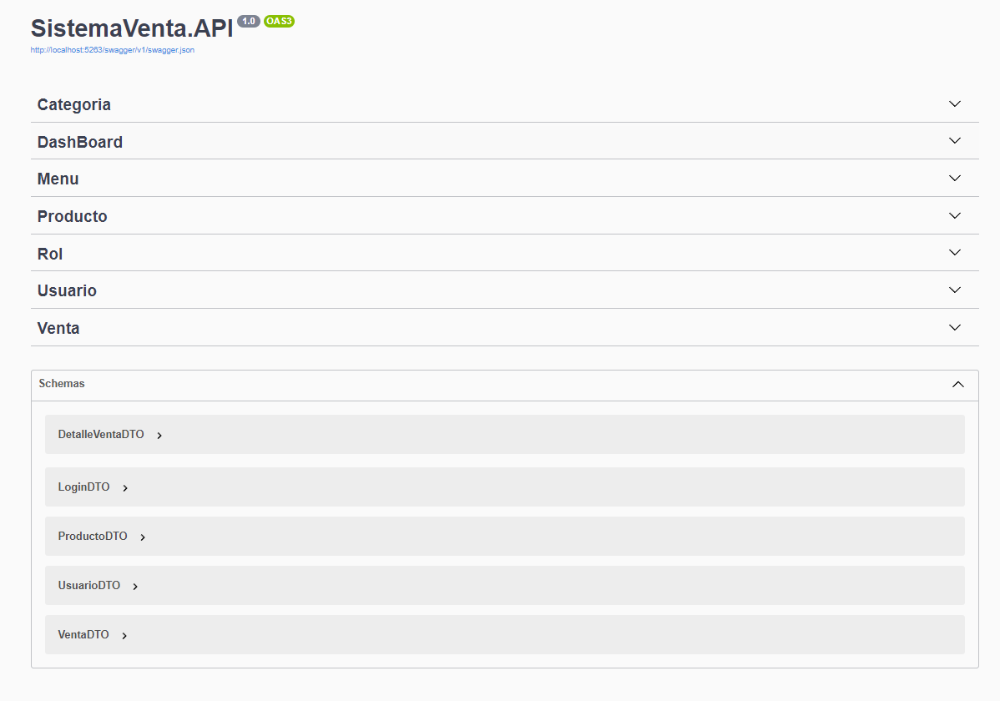

# API de Sistema Ventas

API de sistema de ventas, una solución diseñada con una arquitectura basada en capas y desarrollada en la última versión de .NET 7. La API cuenta con una capa de acceso a datos (DAL) que abstrae la complejidad de acceso a datos y proporciona una interfaz simple y coherente para las capas superiores. También cuenta con una capa de lógica de negocio (BLL) que define las reglas de negocio y los algoritmos que procesan los datos y realizan las operaciones del negocio. Además, la API utiliza patrones de diseño como DTO, IOC, Model y Utility para reducir el acoplamiento entre las diferentes capas de la aplicación y mejorar el rendimiento. Todo esto se traduce en una solución más robusta, flexible y escalable para gestionar los procesos de ventas de tu negocio de manera eficiente.

